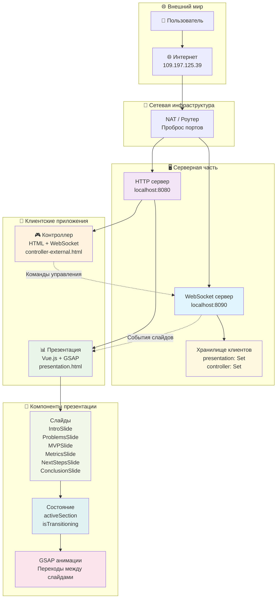
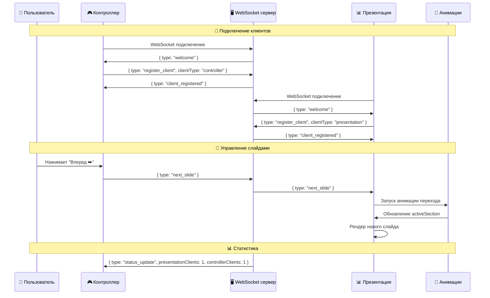
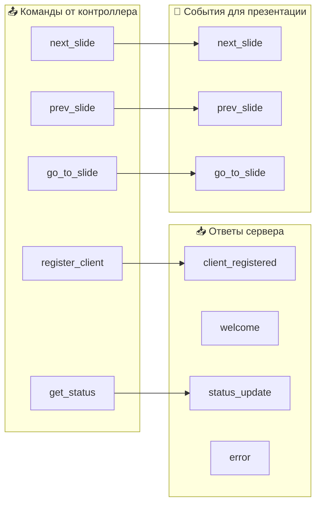

# 🎮 Система презентаций с WebSocket

Интерактивная система для управления презентациями через WebSocket с двумя типами клиентов:

- **📊 Презентация** - Vue.js приложение с GSAP анимациями для отображения слайдов
- **🎮 Контроллер** - HTML интерфейс для управления презентацией

## 🏗️ Архитектура

### Основные сущности и потоки



### Поток данных



### WebSocket сообщения



## 🚀 Быстрый старт

### 1. Запуск WebSocket сервера

```bash
npm run server
```

Сервер запустится на `ws://109.197.125.39:8090`

### 2. Запуск HTTP сервера

```bash
python3 -m http.server 8080
```

Или используй любой HTTP сервер на порту 8080

### 3. Открытие клиентов

- **Презентация:** `http://109.197.125.39:8080/presentation.html`
- **Контроллер:** `http://109.197.125.39:8080/controller-external.html`

## 📋 Доступные команды

### Контроллер

- **⬅️ Назад** - предыдущий слайд
- **Вперед ➡️** - следующий слайд
- **Перейти к слайду** - переход к конкретному слайду (0-5)
- **Копировать ссылку** - копирование URL презентации

### WebSocket команды

```json
{
  "type": "register_client",
  "clientType": "presentation|controller"
}
{
  "type": "next_slide"
}
{
  "type": "prev_slide"
}
{
  "type": "go_to_slide",
  "slideIndex": 0
}
```

## 🎨 Слайды презентации

Система включает 6 интерактивных слайдов:

1. **IntroSlide** - Вступление
2. **ProblemsSlide** - Проблемы и профиты
3. **MVPSlide** - План действий (MVP за 2 недели)
4. **MetricsSlide** - Метрики прогресса
5. **NextStepsSlide** - Следующие шаги
6. **ConclusionSlide** - Заключение

Каждый слайд использует GSAP для плавных анимаций и переходов.

## 🔧 Технический стек

### Backend

- **Node.js** - WebSocket сервер
- **ws** - WebSocket библиотека
- **HTTP сервер** - статические файлы

### Frontend

- **Vue.js 3** - реактивность и компоненты
- **GSAP** - анимации и переходы
- **Tailwind CSS** - стилизация
- **Vite** - сборка

### Сеть

- **WebSocket** - real-time коммуникация
- **NAT** - внешний доступ
- **HTTP** - статические файлы

## 🌐 Внешний доступ

**IP:** `109.197.125.39`

| Порт | Назначение       | URL                          |
| ---- | ---------------- | ---------------------------- |
| 8090 | WebSocket сервер | `ws://109.197.125.39:8090`   |
| 8080 | HTTP презентация | `http://109.197.125.39:8080` |

## 📁 Структура проекта

```
client/
├── src/
│   ├── server.js              # WebSocket сервер
│   ├── App.vue               # Vue.js презентация
│   ├── components/           # Слайды презентации
│   │   ├── IntroSlide.vue
│   │   ├── ProblemsSlide.vue
│   │   ├── MVPSlide.vue
│   │   ├── MetricsSlide.vue
│   │   ├── NextStepsSlide.vue
│   │   └── ConclusionSlide.vue
│   └── controller.html       # Контроллер
├── presentation.html         # Основная презентация
├── controller-external.html  # Внешний контроллер
├── config/                   # Конфигурации портов
└── architecture.md          # Детальная архитектура
```

## 🎯 Использование

1. **Запусти сервер:** `npm run server`
2. **Запусти HTTP:** `python3 -m http.server 8080`
3. **Открой презентацию:** `http://109.197.125.39:8080/presentation.html`
4. **Открой контроллер:** `http://109.197.125.39:8080/controller-external.html`
5. **Управляй презентацией** через контроллер

## 🔧 Альтернативные порты

```bash
# WebSocket серверы
npm run server:8090
npm run server:8091
npm run server:8092

# HTTP серверы
npm run presentation:8081
npm run presentation:8082
```

## 📊 Статистика подключений

Сервер отслеживает:

- Количество подключенных презентаций
- Количество подключенных контроллеров
- Статус каждого клиента

## 🛠️ Разработка

### Добавление нового слайда

1. Создай компонент в `src/components/`
2. Добавь в `sections` в `App.vue`
3. Реализуй GSAP анимации

### Изменение WebSocket логики

1. Отредактируй `src/server.js`
2. Добавь новые типы сообщений
3. Обнови обработчики в клиентах

## 🔒 Безопасность

- WebSocket сервер принимает подключения с любого IP
- Нет аутентификации (для демо)
- Рекомендуется добавить авторизацию для продакшена

## 📝 Логи

Сервер выводит:

- Подключения/отключения клиентов
- Полученные команды
- Статистику подключений
- Ошибки WebSocket

---

**Создано для демонстрации интерактивных презентаций с real-time управлением** 🚀
