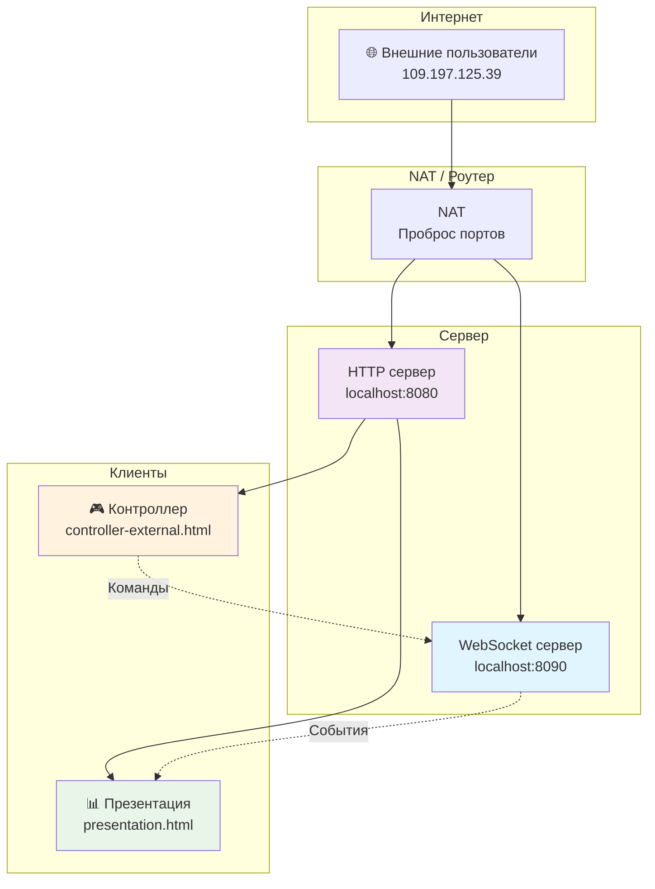
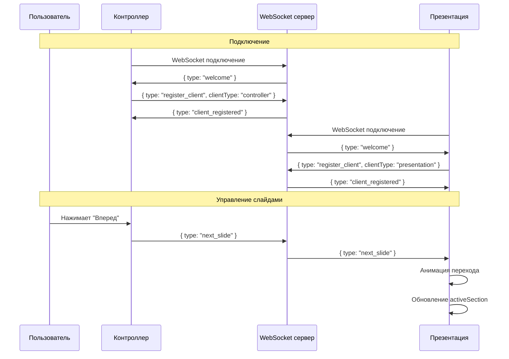
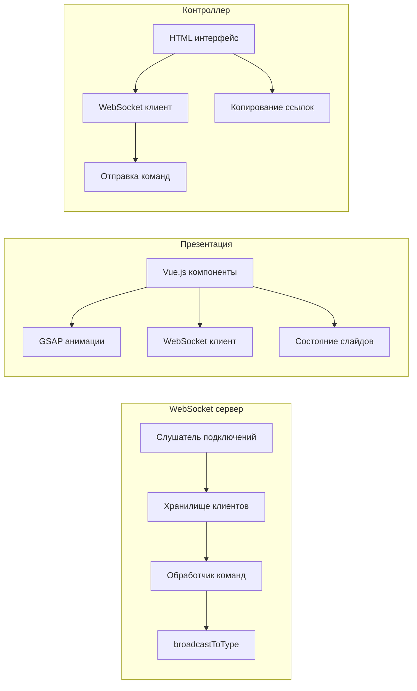
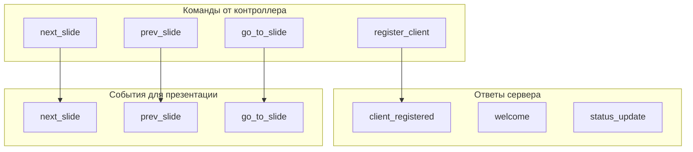
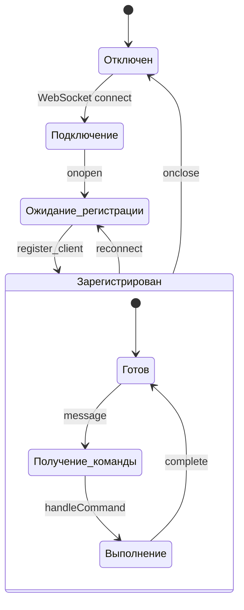
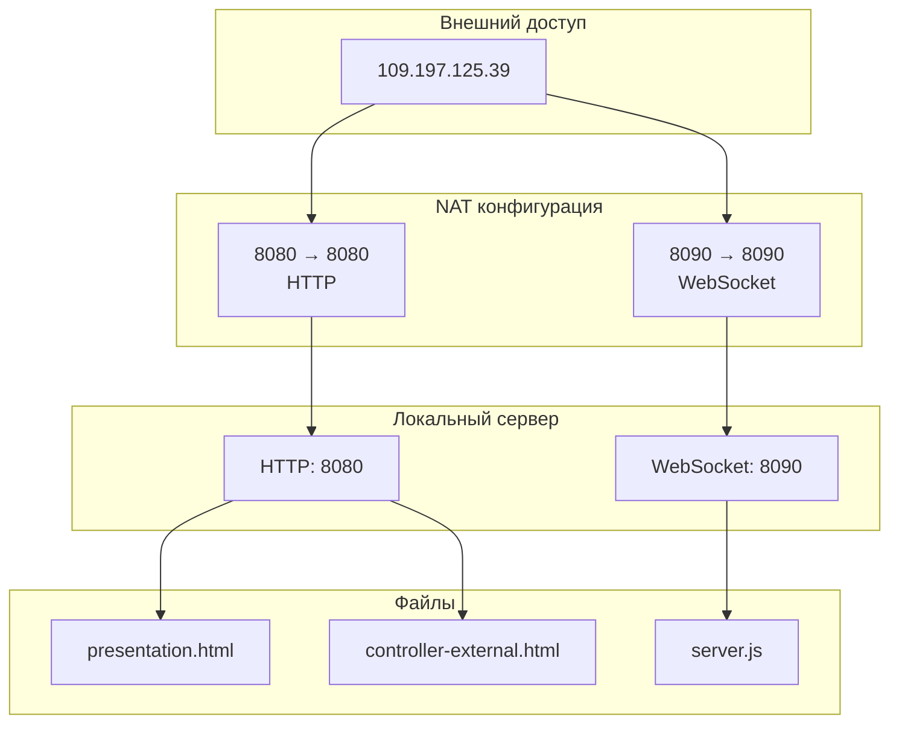

# 🏗️ Архитектура системы презентаций

## Схема системы

```mermaid
graph TB
    subgraph "Интернет"
        External[🌐 Внешние пользователи<br/>109.197.125.39]
    end

    subgraph "NAT / Роутер"
        NAT[NAT<br/>Проброс портов]
    end

    subgraph "Сервер"
        WS[WebSocket сервер<br/>localhost:8090]
        HTTP[HTTP сервер<br/>localhost:8080]
    end

    subgraph "Клиенты"
        Presentation[📊 Презентация<br/>presentation.html]
        Controller[🎮 Контроллер<br/>controller-external.html]
    end

    External --> NAT
    NAT --> WS
    NAT --> HTTP
    HTTP --> Presentation
    HTTP --> Controller
    Controller -.->|Команды| WS
    WS -.->|События| Presentation

    style WS fill:#e1f5fe
    style HTTP fill:#f3e5f5
    style Presentation fill:#e8f5e8
    style Controller fill:#fff3e0
```

## Поток данных

```mermaid
sequenceDiagram
    participant U as Пользователь
    participant C as Контроллер
    participant S as WebSocket сервер
    participant P as Презентация

    Note over U,P: Подключение
    C->>S: WebSocket подключение
    S->>C: { type: "welcome" }
    C->>S: { type: "register_client", clientType: "controller" }
    S->>C: { type: "client_registered" }

    P->>S: WebSocket подключение
    S->>P: { type: "welcome" }
    P->>S: { type: "register_client", clientType: "presentation" }
    S->>P: { type: "client_registered" }

    Note over U,P: Управление слайдами
    U->>C: Нажимает "Вперед"
    C->>S: { type: "next_slide" }
    S->>P: { type: "next_slide" }
    P->>P: Анимация перехода
    P->>P: Обновление activeSection
```

## Компоненты системы

```mermaid
graph LR
    subgraph "WebSocket сервер"
        A[Слушатель подключений]
        B[Хранилище клиентов]
        C[Обработчик команд]
        D[broadcastToType]
    end

    subgraph "Презентация"
        E[Vue.js компоненты]
        F[GSAP анимации]
        G[WebSocket клиент]
        H[Состояние слайдов]
    end

    subgraph "Контроллер"
        I[HTML интерфейс]
        J[WebSocket клиент]
        K[Отправка команд]
        L[Копирование ссылок]
    end

    A --> B
    B --> C
    C --> D
    E --> F
    E --> G
    E --> H
    I --> J
    J --> K
    I --> L
```

## Типы сообщений

```mermaid
graph TD
    subgraph "Команды от контроллера"
        C1[next_slide]
        C2[prev_slide]
        C3[go_to_slide]
        C4[register_client]
    end

    subgraph "Ответы сервера"
        S1[client_registered]
        S2[welcome]
        S3[status_update]
    end

    subgraph "События для презентации"
        P1[next_slide]
        P2[prev_slide]
        P3[go_to_slide]
    end

    C1 --> P1
    C2 --> P2
    C3 --> P3
    C4 --> S1
```

## Состояния подключения

```mermaid
stateDiagram-v2
    [*] --> Отключен
    Отключен --> Подключение: WebSocket connect
    Подключение --> Ожидание_регистрации: onopen
    Ожидание_регистрации --> Зарегистрирован: register_client
    Зарегистрирован --> Отключен: onclose
    Зарегистрирован --> Ожидание_регистрации: reconnect

    state Зарегистрирован {
        [*] --> Готов
        Готов --> Получение_команды: message
        Получение_команды --> Выполнение: handleCommand
        Выполнение --> Готов: complete
    }
```

## Сетевая архитектура

```mermaid
graph TB
    subgraph "Внешний доступ"
        EXT[109.197.125.39]
    end

    subgraph "NAT конфигурация"
        NAT1[8090 → 8090<br/>WebSocket]
        NAT2[8080 → 8080<br/>HTTP]
    end

    subgraph "Локальный сервер"
        WS[WebSocket: 8090]
        HTTP[HTTP: 8080]
    end

    subgraph "Файлы"
        P[presentation.html]
        C[controller-external.html]
        S[server.js]
    end

    EXT --> NAT1
    EXT --> NAT2
    NAT1 --> WS
    NAT2 --> HTTP
    HTTP --> P
    HTTP --> C
    WS --> S
```
