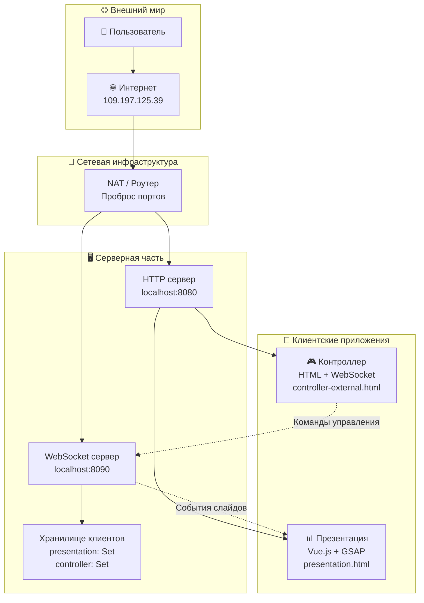

# 📚 Документация системы презентаций

Добро пожаловать в документацию системы презентаций с WebSocket! Здесь вы найдете всю необходимую информацию для работы с проектом.

## 🚀 Быстрый старт

### Установка и запуск

```bash
# Клонирование репозитория
git clone <repository-url>
cd present

# Установка зависимостей
npm install

# Запуск WebSocket сервера
npm run server

# В новом терминале - запуск HTTP сервера
npm run presentation

# Открытие в браузере
# Презентация: http://localhost:8080/presentation.html
# Контроллер: http://localhost:8080/controller-external.html
```

### Внешний доступ

- **Презентация:** `http://109.197.125.39:8080/presentation.html`
- **Контроллер:** `http://109.197.125.39:8080/controller-external.html`
- **WebSocket:** `ws://109.197.125.39:8090`

## 📖 Содержание документации

### Основная документация

- **[README.md](../README.md)** - Основная документация проекта
- **[architecture.md](../architecture.md)** - Детальная архитектура системы

### Техническая документация

- **[API.md](API.md)** - WebSocket API и протоколы
- **[DEVELOPMENT.md](DEVELOPMENT.md)** - Руководство разработчика
- **[DEPLOYMENT.md](DEPLOYMENT.md)** - Развертывание и продакшн

### Поддержка

- **[TROUBLESHOOTING.md](TROUBLESHOOTING.md)** - Устранение неполадок
- **[CHANGELOG.md](CHANGELOG.md)** - История изменений

## 🏗️ Архитектура системы



## 🎯 Основные возможности

### Презентация
- **6 интерактивных слайдов** с GSAP анимациями
- **Real-time управление** через WebSocket
- **Адаптивный дизайн** с Tailwind CSS
- **Плавные переходы** между слайдами

### Контроллер
- **Простой HTML интерфейс** для управления
- **Навигация по слайдам** (вперед/назад)
- **Прямой переход** к конкретному слайду
- **Копирование ссылок** презентации

### WebSocket сервер
- **Real-time коммуникация** между клиентами
- **Статистика подключений** в реальном времени
- **Обработка ошибок** и переподключение
- **Масштабируемость** до 100 одновременных подключений

## 🛠️ Технический стек

### Backend
- **Node.js** - серверная платформа
- **ws** - WebSocket библиотека
- **HTTP сервер** - статические файлы

### Frontend
- **Vue.js 3** - реактивность и компоненты
- **GSAP** - анимации и переходы
- **Tailwind CSS** - стилизация
- **Vite** - сборка и разработка

### Сеть
- **WebSocket** - real-time коммуникация
- **HTTP** - статические файлы
- **NAT** - внешний доступ

## 📊 Слайды презентации

| Слайд | Компонент | Описание |
|-------|-----------|----------|
| 1 | `IntroSlide` | Вступление и обзор |
| 2 | `ProblemsSlide` | Проблемы и профиты |
| 3 | `MVPSlide` | План действий (MVP за 2 недели) |
| 4 | `MetricsSlide` | Метрики прогресса |
| 5 | `NextStepsSlide` | Следующие шаги |
| 6 | `ConclusionSlide` | Заключение |

## 🔧 Команды управления

### Контроллер
- **⬅️ Назад** - предыдущий слайд
- **Вперед ➡️** - следующий слайд
- **Перейти к слайду** - переход к конкретному слайду (0-5)
- **Копировать ссылку** - копирование URL презентации

### WebSocket команды
```json
{
  "type": "register_client",
  "clientType": "presentation|controller"
}
{
  "type": "next_slide"
}
{
  "type": "prev_slide"
}
{
  "type": "go_to_slide",
  "slideIndex": 0
}
```

## 🚀 Развертывание

### Локальное развертывание
```bash
npm run server          # WebSocket сервер
npm run presentation    # HTTP сервер
```

### Продакшн развертывание
```bash
# С PM2
pm2 start ecosystem.config.js

# С Docker
docker-compose up -d

# С nginx
sudo systemctl restart nginx
```

## 🔍 Отладка

### Логирование
```bash
# Серверные логи
pm2 logs presentation-server

# Системные логи
sudo journalctl -u pm2-root -f
```

### Диагностика
```bash
# Проверка процессов
ps aux | grep node

# Проверка портов
netstat -tulpn | grep :8090

# Проверка подключений
curl -I http://localhost:8080
```

## 📞 Поддержка

### Частые проблемы
- [WebSocket не подключается](TROUBLESHOOTING.md#websocket-подключение)
- [Презентация не загружается](TROUBLESHOOTING.md#http-сервер)
- [Слайды не переключаются](TROUBLESHOOTING.md#презентация)

### Полезные ссылки
- [API документация](API.md)
- [Руководство разработчика](DEVELOPMENT.md)
- [Развертывание](DEPLOYMENT.md)
- [Устранение неполадок](TROUBLESHOOTING.md)

## 🤝 Вклад в проект

### Разработка
1. Форкните репозиторий
2. Создайте feature ветку
3. Внесите изменения
4. Создайте Pull Request

### Документация
- Исправляйте ошибки в документации
- Добавляйте новые примеры
- Улучшайте описания

### Тестирование
- Тестируйте новые функции
- Сообщайте о багах
- Предлагайте улучшения

---

**Создано для демонстрации интерактивных презентаций с real-time управлением** 🚀